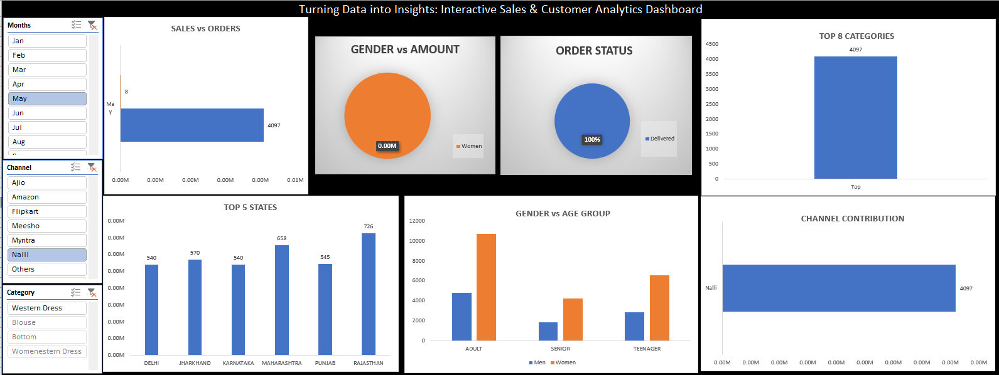

# E-Commerce Sales & Customer Analytics Dashboard

## Project Overview

This project is an interactive E-Commerce Sales & Customer Analytics Dashboard developed using Microsoft Excel. The dashboard converts raw sales data into meaningful business insights through data visualization, pivot tables, pivot charts, and slicers.

It enables users to analyze sales performance, customer demographics, order status, product categories, and sales channels in an interactive manner.

---

## Dashboard Preview

---

## Features

- Interactive dashboard with slicers
- Sales vs Orders Analysis
- Gender-wise Revenue Analysis
- Order Status Tracking
- Top Performing States Analysis
- Top Categories Analysis
- Channel Contribution Analysis
- Customer Age Group Analysis
- Dynamic filtering by Month, Channel, and Category

---

## Tools & Technologies

- Microsoft Excel
- Pivot Tables
- Pivot Charts
- Slicers
- Data Cleaning
- Data Visualization
- Business Analytics

---

## Business Insights

- Identified top-performing states based on sales.
- Analyzed customer purchasing behavior across demographics.
- Evaluated channel-wise sales contribution.
- Tracked order fulfillment performance.
- Highlighted top-selling product categories.

---

## Skills Demonstrated

- Data Analytics
- Dashboard Development
- Business Intelligence
- Data Visualization
- Reporting
- Microsoft Excel

---

## Author

**Sujal Rajput**

B.Tech Robotics & Automation  
Symbiosis Institute of Technology, Pune
